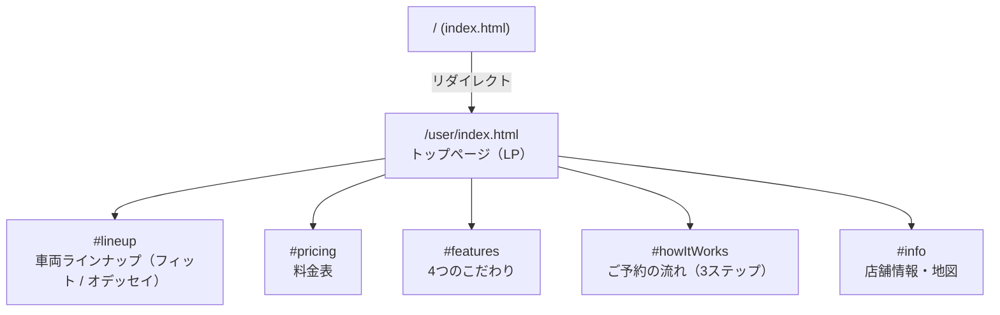
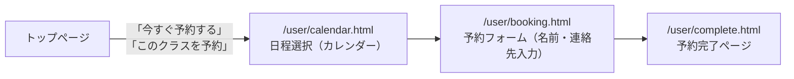
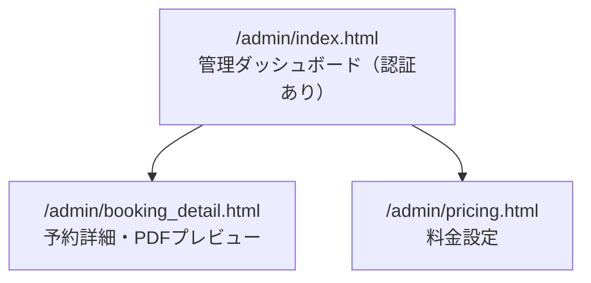
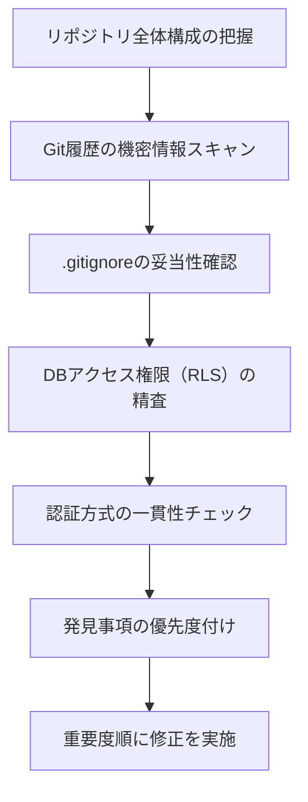

# レンタカー予約・管理システム (Rentacar-Site-Open)

レンタカーの予約から管理までを一貫して行うフルスタックWebアプリケーションです。

home-admin-passのオープンサイトです
パスワードと個人がわかるのもは書いてないのでご了承下さい

## 概要

ユーザー向けの予約サイトと、管理者向けのダッシュボードを一つのシステムとして構築。予約の受付からステータス管理、料金設定、決済までをカバーしています。

## 技術スタック

- **HTML / JavaScript** — フロントエンド（ユーザー向けLP・予約フォーム）
- **TypeScript / Next.js** — 管理者ダッシュボード
- **Supabase** — データベース・認証
- **Stripe** — オンライン決済
- **Netlify** — ホスティング・デプロイ

## 機能一覧

### ユーザー向け（/user/）

- 車両ラインナップの閲覧（フィット / オデッセイ）
- 料金表の確認
- カレンダーから日程を選択して予約
- 予約フォームの入力・送信
- Stripe決済
- 英語版ページ対応

### 管理者向け（/admin/）

- 管理者認証によるログイン
- 予約一覧の確認・ステータス管理
- 予約詳細のPDFプレビュー
- 料金設定（CDW・車種別料金の動的変更）

## サイト構成

### ユーザー側の画面遷移

### 予約フロー

### 管理者側

### その他

- `/english/index.html` ← 英語版ページ
- `/user/terms.html` ← 利用規約

## ディレクトリ構成

| フォルダ | 内容 |
|---|---|
| `user/` | ユーザー向けページ（予約フロー） |
| `admin/` | 管理者向けページ（ダッシュボード） |
| `app/` | Next.js アプリケーション（管理画面） |
| `lib/` | Supabase接続設定 |
| `js/` | 共通JavaScriptファイル |
| `english/` | 英語版ページ |
| `public/` | 静的ファイル |

## セキュリティレビューで実施したこと

開発の過程で、Claude Codeを使ったセキュリティレビューを実施しました。個人開発でありながら実運用（決済・個人情報の取り扱い）を想定したアプリケーションだったため、以下の観点でチェックしています。

### レビューの観点

- **機密情報の管理**：APIキーやパスワードが平文でコミットされていないか、`.gitignore` が `.env` 等を正しく除外できているかをGit履歴全体まで遡って確認
- **DBアクセス制御**：SupabaseのRow Level Security（RLS）ポリシーが、想定したロール（匿名ユーザー／認証済み管理者）に対して過不足のない権限になっているかを精査
- **認証方式の一貫性**：ページごとに異なる認証ロジックが実装されていないか、サーバー側で検証されずクライアント側のみの判定になっている箇所がないかを確認
- **保守性**：責務分離やディレクトリ構成の重複など、将来的な不具合の温床になりうる設計上の課題も合わせて洗い出し

### 得られた学び

フロントエンドの入力チェックだけでは不十分で、DB側のアクセス制御（RLS）まで一貫して検証する必要があることを実務レベルで確認できました。また、認証ロジックが機能追加のたびに分散しやすいこと、静的サイトの複製構成が保守コストを上げることなど、個人開発でも設計初期から意識すべき点を学びました。

## 今後の改善予定

- 予約ボタンのリンク先を統一（車種パラメータ `?car=xxx` を全ボタンに付与）
- 「車種選択 → 日程 → 入力 → 完了」のフローに統一
